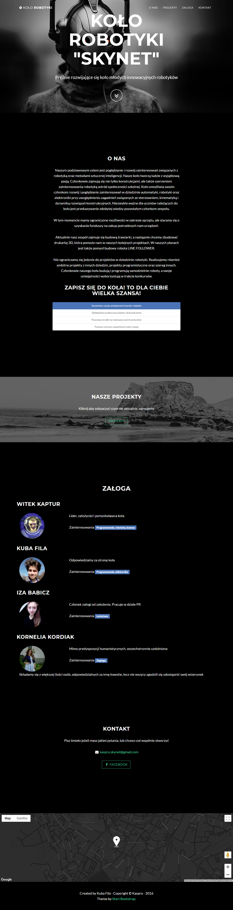

# KASPRO SKYNET
> Website website of robotics classes

## General info
Responsive website of robotics classes in my school. 
It's based on [Start Bootstrap](http://startbootstrap.com/) - [Grayscale theme](http://startbootstrap.com/template-overviews/grayscale/)

## Screenshots

## Technologies
* Bootstrap v3.3.7 
* Font Awesome 4.6.3

